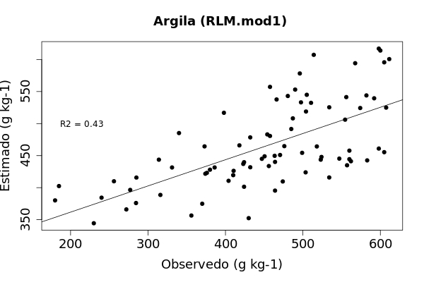
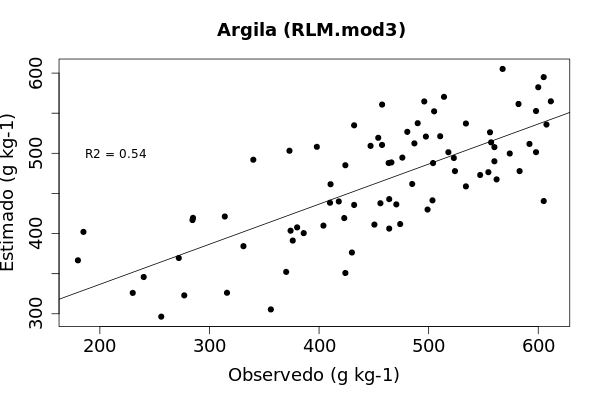
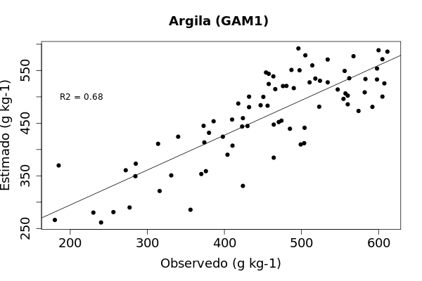
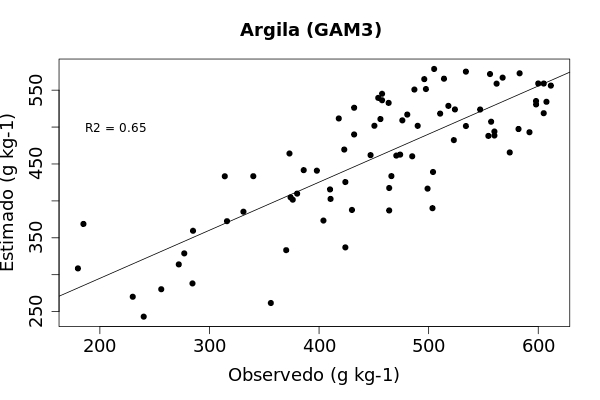

---
title: 'Métodos e Técnicas de MDS '
author: "Elias Mendes Costa"
date: "`r Sys.Date()`"
knit: (function(inputFile, encoding) {
  rmarkdown::render(inputFile, encoding = encoding, output_dir = "../docs") })
output: 
  bookdown::html_document2:
csl: geoderma-regional.csl
rmarkdown::html_document:
  theme: united
  toc: yes
subtitle: Predição de atributos do solo usando modelos lineares e não lineares
bibliography: mendeley.bib
vignette: |
  %\VignetteEngine{knitr::rmarkdown} %\VignetteEncoding{UTF-8}
---  
  
```{r setup, include=FALSE}
knitr::opts_chunk$set(echo = FALSE)
```

```{r require}
# install.packages("outliers")
library(outliers)
# install.packages("ade4")
library(ade4)
# install.packages("gstat")
# library(gstat)
# install.packages("RSNNS")
# library(RSNNS)
# install.packages("spsurvey")
# library(spsurvey)
# install.packages("foreign")
library(foreign)
# install.packages("sp")
library(sp)
library(caret)
library(Metrics)
library(readr)
library(gridExtra)
library(ggplot2)
```
# Modelos lineares

## Regressão linear 
A equação geral de regressão linear múltipla é dada por:
Yi=β0, β1X1, β2X2, β3X3... βiXi + ε
onde Yi é o valor da variável dependente na i-ésima observação, β0, β1, β2, β3... βi são parâmetros, X1, X2, X3 ... Xi, são constantes conhecidas, ou seja, o valor das variáveis preditoras na i-ésima observação, ε é o erro aleatório com média E{ε} = 0 e variância σ²{εi} = σ², e i = 1, ... , n [@Hastie2009].

### Dentre as principais vantagens (Potencialidades) tem-se:
São modelos relativamente simples, e sua interpretação é facilitada pois é possível construir equações de predição. Ainda é possível avaliar a contribuição de cada variável para o ajuste do modelo de regressão, bem como selecionar (por exemplo método Stepwise) as variáveis mais relevantes ao modelo. Não exige grande capacidade computacional comparando-se a exigência computacional de modelos não paramétricos, que normalmente são mais complexos. As variáveis preditoras podem ser qualitativas ou variáveis dummy [@Hastie2009; @Samuel-Rosa2012; @Moura-Bueno2014; @Dotto2014; @Chagas2016].
	
### Dentre as principais desvantagens (Limitações) tem-se:

As principais limitações da RLM estão relacionadas aos pressupostos estatísticos que são exigidos na modelagem utilizando o modelo de regressão linear. 
- 1. E ε i = 0 para todo i = 1, 2, ... , n. (Os erros possuem média 0). 
- 2. Os erros são homocedásticos, isto é, Var ε i = σ 2 para todo i = 1, 2, ... , n. (Homocedasticidade)
- 3. Os erros são independentes, isto é, cov ε i , ε j = 0 para todo i ≠ j. (Independência dos erros)
- 4. Os erros têm distribuição normal. (Normalidade)
- 5. Exigência de linearidade entre as variáveis regressoras (preditoras) e a variável dependente (propriedade do solo) [@Hastie2009]
Ainda estão sujeitos aos efeitos da multicolinearidade. No caso de ocorrência de multicolinearidade das variáveis preditoras há aumento da variância dos parâmetros ajustados [@Hair2009]

# Modelos *não* Lineares

## Modelo Aditivo Generalizado (GAM)
A equação geral do GAM é dada por:
E(Y|X1,X2, . . . ,Xi)=α + f1(X1) + f2(X2) + · · · + fi(Xi)
Como o usual X1,X2, . . . ,Xi representa os preditores (covariáveis) e Y a saída (variável resposta), α é um parâmetro a ser estimado, f são as funções de suavização não especificadas (não paramétricas) [@Hastie2009]. 

### Dentre as principais vantagens (Potencialidades) tem-se:
Possibilita o ajuste dos modelos considerando as relações não lienares entre as variváveis através das funçpões de suavização. Sua interpretação é relativamente simples, comparado a modelos de aprendizado de máquina. Não tem as mesmas exigências dos presupostos estatisticos assim como nos modelos de Regressão Linear.  As variáveis preditoras podem ser qualitativas ou variáveis dummy [@Hastie2009; @Wood2006]. 

### Dentre as principais desvantagens (Limitações) tem-se:
São modelos computacionalmente mais exigentes. Há uma limitação no uso de grande número covariáveis e seleção por métodos como Stepwise quando o número de amostras é pequeno. Pode ser complexa a selação da melhor curva de suavização [@Hastie2009; @Wood2006]. 

## Ajustando modelos de Regressão Linear
```{r load, echo = TRUE}
### carregando os dados
dados <- foreign::read.dbf("../data/Treino1.dbf")
names(dados) # ver os nomes dos campos na tabela
str(dados) # ver a estrutura da tabela de dados
summary(dados)
```


```{r RLM, echo = TRUE}
### Ajustando alguns modelos teste
form0 = stats::formula (Argila~1)
form1 = stats::formula (Argila~B1+B2+B3+B4+B5+B7)
form2 = stats::formula (Argila~X+Y+B1+B2+B3+B4+B5+B7+NDVI+B3_B2+B3_B7+B5_B7)

mod0 <- stats::lm (formula = form0, data=dados)
mod1 <- stats::lm (formula = form1, data=dados)
mod2 <- stats::lm (formula = form2, data=dados)

# Ver os modelos
mod0
mod1
mod2

# Test F pela ANOVA
anova(mod0,mod1)
anova(mod0,mod2)

# ANOVA Particionada:
anova(mod0,mod1,mod2)

# test T
summary(mod1)
summary(mod2)
```

No primeiro momento, pelo test F,  foi testada se é significativa a inclusão das variáveis, ideal que fosse testado cada variável separadamente, mas não se aplica por exemplo em casos que há centenas e até mesmo milhares de variáveis regressoras (covariáveis). 
Após ter testado a significância dos modelos em relação ao molode apenas com o intercepto, foi feito o teste para verificar se a contribuição de uma determinada covariável é significativa pelo test T.


```{r, selecao_rlm}
### Fazendo seleção automática de covariáveis
# Stepwise selection
mod3 <- MASS::stepAIC (lm(formula=form2, method = "forward", data=dados ))

# RFE selection
lm <- caret::rfeControl (functions=lmFuncs, method="LOOCV") # lm function 
mod4 <- caret::rfe(dados[,c(2,3,9:18)], dados[,4], sizes=c(1:8), rfeControl=lm)
predictors(mod4) # preditores selecionados
mod4$fit # modelo
```


```{r diag_rlm, echo = TRUE}
### Algumas informações diagnosticas sobre os modelos ajustados (MLR)
stats::shapiro.test(resid(mod1)) # Testar os resíduos de normalidade do modelo de regressão
lmtest::bptest(mod1) # Homoscedasticidade de variância
par(mfrow=c(2,2))
plot(mod1,which=1:4)

stats::shapiro.test(resid(mod3)) # Testar os resíduos de normalidade do modelo de regressão
lmtest::bptest(mod3) # Homoscedasticidade de variância
par(mfrow=c(2,2))
plot(mod3,which=1:4)
```


```{r results_rlm, echo = TRUE}
# Escrevendo os resultados de ajuste dos modelos numa tabela
resultados =  as.data.frame(matrix(NA,4,4)) # 4 linha e 4 colunas
names(resultados) = c("Modelo","R2", "n_covars","covars")
#mod1
resultados[1,1] = paste(as.character(formula(mod1)[2]),"mod1", sep=" ")
resultados[1,2] = summary(mod1)$r.squared
resultados[1,3] = nrow(summary(mod1)$coefficients)-1
resultados[1,4] = as.character(formula(mod1)[3])

#mod2
resultados[2,1] = paste(as.character(formula(mod2)[2]),"mod2", sep=" ")
resultados[2,2] = summary(mod2)$r.squared
resultados[2,3] = nrow(summary(mod2)$coefficients)-1
resultados[2,4] = as.character(formula(mod2)[3])

#mod3
resultados[3,1] = paste(as.character(formula(mod3)[2]),"mod3", sep=" ")
resultados[3,2] = summary(mod3)$r.squared
resultados[3,3] = nrow(summary(mod3)$coefficients)-1
resultados[3,4] = as.character(formula(mod3)[3])

#mod4
resultados[4,1] = paste(as.character(formula(mod3)[2]),"mod4", sep=" ")
resultados[4,2] = mod4$results$Rsquared[9]
resultados[4,3] = mod4$bestSubset
resultados[4,4] = as.character(formula(mod2)[3])
resultados
write.csv(resultados, file="../res/tab/ajuste_modelos.MLR.csv")
```


```{r valida_rlm, echo = TRUE}
### Vazendo a validação dos resultados usando um conjunto de amostra independente
# Lwndo os dados de validação
dados.valida <- read.dbf("../data/Teste1.dbf")

## Fazendo as predições nos dados de validação usando os 4 modelos
valida1 <- predict(mod1, newdata = dados.valida)
valida2 <- predict(mod2, newdata = dados.valida)
valida3 <- predict(mod3, newdata = dados.valida)
valida4 <- predict(mod4, newdata = dados.valida)
dados.valida=cbind(dados.valida, valida1, valida2, valida3, valida4) # juntar os dataframes das prediçpões com os valores obervados

## Calculando o R2 da validação
R.mod1=summary(lm(Argila~valida1,data=dados.valida))
R.mod2=summary(lm(Argila~valida2,data=dados.valida))
R.mod3=summary(lm(Argila~valida3,data=dados.valida))
R.mod4=summary(lm(Argila~valida4,data=dados.valida))

## Calculando RMSE e MSE
RMSE1 <- rmse(dados.valida$Argila, dados.valida$valida1); MSE1 <- mse(dados.valida$Argila, dados.valida$valida1)
RMSE2 <- rmse(dados.valida$Argila, dados.valida$valida2); MSE2 <- mse(dados.valida$Argila, dados.valida$valida2)
RMSE3 <- rmse(dados.valida$Argila, dados.valida$valida3); MSE3 <- mse(dados.valida$Argila, dados.valida$valida3)
RMSE4 <- rmse(dados.valida$Argila, dados.valida$valida4); MSE4 <- mse(dados.valida$Argila, dados.valida$valida4) 
```


```{r tab_valida_rlm, echo = TRUE}
### Criando uma tabela de resultados com o resultado da validação externa
## Pegando os resultados de R2, RMSE e MSE de cada modelo
rlm.df.rsq=c(R.mod1$r.squared,R.mod2$r.squared,R.mod3$r.squared,R.mod4$r.squared)
rlm.df.RMSE=c(RMSE1, RMSE2, RMSE3, RMSE4)
rlm.df.MSE=c(MSE1, MSE2, MSE3, MSE4)
mods=c("RLM1","RLM2","RLM3", "RLM4")

## escolhendo o número de dígitos
rlm.df.rsq=round(rlm.df.rsq, digits = 2)
rlm.df.RMSE=round(rlm.df.RMSE, digits = 3)
rlm.df.MSE=round(rlm.df.MSE, digits = 3)

## criando um dataframe com os resultados
rlm.df.external=cbind(Modelo=mods,R2=rlm.df.rsq, RMSE=rlm.df.RMSE, MSE=rlm.df.MSE)
rlm.df.external=as.data.frame(rlm.df.external)
rlm.df.external
write.csv(rlm.df.external, file = "../res/tab/RLM.df.external.csv")
```


```{r figure_rlm}
### Gerando figuras da validação
# FAZER FIGURA DE ESTIMADOS x OBSERVADOS COM R2 #
#mod1
jpeg(filename = "../res/fig/valida.mod1.jpg", width = 600, height = 400, units = "px", pointsize = 12,
     quality = 100, bg = "white", res = NA, family = "")
par(mfrow=c(1,1)) 
{plot(valida1~Argila,xlab="Observedo (g kg-1)", data=dados.valida, ylab="Estimado (g kg-1)", main="Argila (RLM.mod1) ", cex.lab=1.5, cex.main=1.5, cex.axis=1.5,pch = 19)
abline(lm(valida1~Argila, data=dados.valida))
text(200,500,"R2 =",cex=1)
text(230,500,round(summary(lm(Argila~valida1, data=dados.valida))$r.squared,2),cex=1)}
dev.off()

#mod3
jpeg(filename = "../res/fig/valida.mod3.jpg", width = 600, height = 400, units = "px", pointsize = 12,
     quality = 100, bg = "white", res = NA, family = "")
par(mfrow=c(1,1))
{plot(valida3~Argila,xlab="Observedo (g kg-1)", data=dados.valida, ylab="Estimado (g kg-1)", main="Argila (RLM.mod3) ", cex.lab=1.5, cex.main=1.5, cex.axis=1.5,pch = 19)
abline(lm(valida3~Argila, data=dados.valida))
text(200,500,"R2 =",cex=1)
text(230,500,round(summary(lm(Argila~valida3, data=dados.valida))$r.squared,2),cex=1)}
dev.off()
```

```{r figure1, echo=FALSE,message=FALSE, warning=FALSE, fig.cap= "validação",fig.align='center', dpi=80, fig.asp=1}

```
```{r figure2, echo=FALSE,message=FALSE, warning=FALSE, fig.cap= "validação",fig.align='center', dpi=80, fig.asp=1}

```


```{r mapa_rlm, echo=TRUE}
### Gerando o mapa do teor de argila usano o nosso melhor modelo
# importar o grid da area de estudo
gride <- read.dbf("../data/Pontos1.dbf")
gride$X=gride$POINT_X; gride$Y=gride$POINT_Y
names (gride) # ver os nomes das colunas na tabela
pred<-predict(mod3, gride, interval="conf", level=0.95)
pred[1:10,] # mostrar as 10 primeiras linhas da predicao
predicao=cbind(pred[,1],gride[,2:3]) # este data.frame pode ser salvo como CSV e aberto no ArcGIS
predicao[1:10,] # ver os nomes das colunas na tabela
summary(predicao$fit)
gridded(predicao) <- ~POINT_X+POINT_Y # transformar os dados de dataframe para spatialpixeldataframe
plot(predicao)
#### PACOTE ESPECIAL PARA EXPORTAR ####
library(rgdal)
writeGDAL(predicao[,1], "../res/fig/Argila.RLM.sdat", drivername="SAGA",mvFlag=-99999)
```

## Ajustando modelos GAM
```{r GAM, echo=TRUE}
GAM1 = mgcv::gam (Argila~s(X,Y, bs="ts")+s(B1, bs="ts")+s(B2, bs="ts")+
                           s(B3, bs="ts")+s(B4, bs="ts")+ s(B5, bs="ts")+
                    s(B7, bs="ts"), data=dados)
summary(GAM1)

GAM2 = mgcv::gam (Argila~s(X,Y, bs="ts")+s(B1, bs="ts")+s(B2, bs="ts")+
                           s(B3, bs="ts")+s(B4, bs="ts")+ s(B5, bs="ts")+
                    s(B7, bs="ts")+s(NDVI, bs="ts")+s(B3_B2, bs="ts")+
                    s(B3_B7, bs="ts")+s(B5_B7, bs="ts"), 
                  method="REML", select=TRUE, data=dados)
summary(GAM2)

GAM3 <- mgcv::gam (Argila~s(X,Y, bs="ts")+s(B1, bs="ts")+s(B2, bs="ts")+
                     s(B3, bs="ts")+s(B4, bs="ts")+ s(B5, bs="ts")+
                     s(B7, bs="ts")+s(NDVI, bs="ts")+s(B3_B2, bs="ts")+
                     s(B3_B7, bs="ts")+s(B5_B7, bs="ts"), 
                   select=TRUE, data=dados)

summary(GAM3)

## Esse demora bastante
gam <- caret::rfeControl (functions=gamFuncs, method= "LOOCV") # gam function 
GAM4 <- caret::rfe(dados[,c(2,3,9:18)], dados[,4], sizes=c(1:8), rfeControl=gam)
```


```{r diag_gam, echo = TRUE}
### Algumas informações diagnosticas sobre os modelos ajustados (GAM)
#GAM1
par(mfrow=c(2,2))
mgcv::gam.check(GAM1,pch=19,cex=.3, old.style=T)

#GAM3
par(mfrow=c(2,2))
mgcv::gam.check(GAM3,pch=19,cex=.3, old.style=T)
```


```{r results_gam, echo = TRUE}
## Escrevendo os resultados de ajuste dos modelos numa tabela
resultados =  as.data.frame(matrix(NA,4,4)) # 4 linha e 4 colunas
names(resultados) = c("Modelo","R2", "n_covars","covars")
#GAM1
resultados[1,1] = paste(as.character(formula(mod1)[2]),"GAM1", sep=" ")
resultados[1,2] = summary(GAM1)$r.sq
resultados[1,3] = summary(GAM1)$m+1
resultados[1,4] = as.character(formula(GAM1)[3])

#GAM2
resultados[2,1] = paste(as.character(formula(mod2)[2]),"GAM2", sep=" ")
resultados[2,2] = summary(GAM2)$r.sq
resultados[2,3] = summary(GAM2)$m+1
resultados[2,4] = as.character(formula(GAM2)[3])

#GAM3
resultados[3,1] = paste(as.character(formula(mod3)[2]),"GAM3", sep=" ")
resultados[3,2] = summary(GAM3)$r.sq
resultados[3,3] = summary(GAM3)$m+1
resultados[3,4] = as.character(formula(GAM3)[3])

#GAM4
resultados[4,1] = paste(as.character(formula(mod3)[2]),"GAM4", sep=" ")
resultados[4,2] = GAM4$results$Rsquared[4]
resultados[4,3] = GAM4$bestSubset
resultados[4,4] = as.character(GAM4$fit$pred.formula[2])
resultados
write.csv(resultados, file="../res/tab/ajuste_modelos.GAM.csv")
```


```{r valida_gam, echo = TRUE}
### Vazendo a validação dos resultados usando um conjunto de amostra independente
# Lwndo os dados de validação
dados.valida <- read.dbf("../data/Teste1.dbf")

## Fazendo as predições nos dados de validação usando os 4 modelos
valida1 <- predict(GAM1, newdata = dados.valida)
valida2 <- predict(GAM2, newdata = dados.valida)
valida3 <- predict(GAM3, newdata = dados.valida)
valida4 <- predict(GAM4, newdata = dados.valida)
dados.valida=cbind(dados.valida, valida1, valida2, valida3, valida4);names(dados.valida)[24]<-c("valida4") # juntar os dataframes das prediçpões com os valores obervados

## Calculando o R2 da validação
R.mod1=summary(lm(Argila~valida1,data=dados.valida))
R.mod2=summary(lm(Argila~valida2,data=dados.valida))
R.mod3=summary(lm(Argila~valida3,data=dados.valida))
R.mod4=summary(lm(Argila~valida4,data=dados.valida))

## Calculando RMSE e MSE
RMSE1 <- rmse(dados.valida$Argila, dados.valida$valida1); MSE1 <- mse(dados.valida$Argila, dados.valida$valida1)
RMSE2 <- rmse(dados.valida$Argila, dados.valida$valida2); MSE2 <- mse(dados.valida$Argila, dados.valida$valida2)
RMSE3 <- rmse(dados.valida$Argila, dados.valida$valida3); MSE3 <- mse(dados.valida$Argila, dados.valida$valida3)
RMSE4 <- rmse(dados.valida$Argila, dados.valida$valida4); MSE4 <- mse(dados.valida$Argila, dados.valida$valida4) 
```


```{r tab_valida_gam, echo = TRUE}
### Criando uma tabela de resultados com o resultado da validação externa
## Pegando os resultados de R2, RMSE e MSE de cada modelo
gam.df.rsq=c(R.mod1$r.squared,R.mod2$r.squared,R.mod3$r.squared,R.mod4$r.squared)
gam.df.RMSE=c(RMSE1, RMSE2, RMSE3, RMSE4)
gam.df.MSE=c(MSE1, MSE2, MSE3, MSE4)
mods=c("GAM1","GAM2","GAM3", "GAM4")

## escolhendo o número de dígitos
gam.df.rsq=round(gam.df.rsq, digits = 2)
gam.df.RMSE=round(gam.df.RMSE, digits = 3)
gam.df.MSE=round(gam.df.MSE, digits = 3)

## criando um dataframe com os resultados
gam.df.external=cbind(Modelo=mods,R2=gam.df.rsq, RMSE=gam.df.RMSE, MSE=gam.df.MSE)
gam.df.external=as.data.frame(gam.df.external)
gam.df.external
write.csv(gam.df.external, file = "../res/tab/GAM.df.external.csv")
```

```{r, gam_figure, echo = TRUE}
# Fazendo alguns plotes com curvas de suavização para algumas covariáveis
p1 <- qplot(x = NDVI, y = Argila, data = dados , geom = c("point", "smooth"))
p2 <- qplot(x = B1, y = Argila, data = dados  , geom = c("point", "smooth"))
p3 <- qplot(x = B2, y = Argila, data = dados , geom = c("point", "smooth"))
p4 <- qplot(x = B3, y = Argila, data = dados  , geom = c("point", "smooth"))
p5 <- qplot(x = B4, y = Argila, data = dados  , geom = c("point", "smooth"))
p6 <- qplot(x = B5, y = Argila, data = dados , geom = c("point", "smooth"))
p7 <- qplot(x = B7, y = Argila, data = dados , geom = c("point", "smooth"))
grid.arrange(p1, p2, p3, p4, p5, p6, p7, nrow=3, ncol = 3)

```


```{r, figure_gam, echo = TRUE}
### Gerando figuras da validação
# FAZER FIGURA DE ESTIMADOS x OBSERVADOS COM R2 #
#GAM1
jpeg(filename = "../res/fig/valida.GAM1.jpg", width = 600, height = 400, units = "px", pointsize = 12,
     quality = 100, bg = "white", res = NA, family = "")
par(mfrow=c(1,1))
{plot(valida1~Argila,xlab="Observedo (g kg-1)", data=dados.valida, ylab="Estimado (g kg-1)", main="Argila (GAM1) ", cex.lab=1.5, cex.main=1.5, cex.axis=1.5,pch = 19)
abline(lm(valida1~Argila, data=dados.valida))
text(200,500,"R2 =",cex=1)
text(230,500,round(summary(lm(Argila~valida1, data=dados.valida))$r.squared,2),cex=1)}
dev.off()

#GAM3
jpeg(filename = "../res/fig/valida.GAM3.jpg", width = 600, height = 400, units = "px", pointsize = 12,
     quality = 100, bg = "white", res = NA, family = "")
par(mfrow=c(1,1))
{plot(valida3~Argila,xlab="Observedo (g kg-1)", data=dados.valida, ylab="Estimado (g kg-1)", main="Argila (GAM3) ", cex.lab=1.5, cex.main=1.5, cex.axis=1.5,pch = 19)
abline(lm(valida3~Argila, data=dados.valida))
text(200,500,"R2 =",cex=1)
text(230,500,round(summary(lm(Argila~valida3, data=dados.valida))$r.squared,2),cex=1)}
dev.off()
```

```{r figure3, echo=FALSE,message=FALSE, warning=FALSE, fig.cap= "validação",fig.align='center', dpi=80, fig.asp=1}

```
```{r figure4, echo=FALSE,message=FALSE, warning=FALSE, fig.cap= "validação",fig.align='center', dpi=80, fig.asp=1}

```


```{r mapa_gam, echo=TRUE}
### Gerando o mapa do teor de argila usano o nosso melhor modelo
# importar o grid da area de estudo
gride <- read.dbf("../data/Pontos1.dbf")
gride$X=gride$POINT_X; gride$Y=gride$POINT_Y
names (gride) # ver os nomes das colunas na tabela
pred<-predict(GAM1, gride, interval="conf", level=0.95)
predicao=cbind(pred,gride[,2:3]) # este data.frame pode ser salvo como CSV e aberto no ArcGIS
predicao[1:10,] # ver os nomes das colunas na tabela
summary(predicao$fit)
gridded(predicao) <- ~POINT_X+POINT_Y # transformar os dados de dataframe para spatialpixeldataframe
plot(predicao)
#### PACOTE ESPECIAL PARA EXPORTAR ####
library(rgdal)
writeGDAL(predicao[,1], "../res/fig/Argila.GAM.sdat", drivername="SAGA",mvFlag=-99999)
```

# A era das máquinas começou
```{r figure5, echo=FALSE,message=FALSE, warning=FALSE, fig.cap= "Máquina aprendendo",fig.align='center', dpi=80, fig.asp=1}

```

# Referências