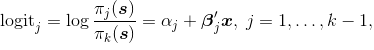
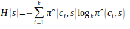

---
title: 'Métodos e Técnicas de MDS '
author: "Elias Mendes Costa"
date: "`r Sys.Date()`"
knit: (function(inputFile, encoding) {
  rmarkdown::render(inputFile, encoding = encoding, output_dir = "../docs") })
output: 
  bookdown::html_document2:
csl: geoderma-regional.csl
rmarkdown::html_document:
  theme: united
  toc: yes
subtitle: Predição de unidades de mapeamento usando a Regressão Logística Múltipla
  Multinomial (RLMM)
bibliography: mendeley.bib
vignette: |
  %\VignetteEngine{knitr::rmarkdown} %\VignetteEncoding{UTF-8}
---  
  
```{r setup, include=FALSE}
knitr::opts_chunk$set(echo = FALSE)
```

```{r require}
## instalacao dos pacotes ###
library(outliers)
# install.packages("ade4")
library(ade4)
# install.packages("base")
library(base)
# install.packages("spsurvey")
# library(spsurvey)
# install.packages("foreign")
library(foreign)
# install.packages("nnet")
library(nnet)
library(RSNNS)
library(sp)
#install.packages("RSNNS")
library(pROC)
library(rgdal)
```
# Modelos Lógisticos

## Regressão Logistica Múltipla Multinomial

A Regressão Logística Múltipla Multinomial é uma técnica usada exclusivamente para predição de variáveis categóricas como classes de solos. É um método paramétrico que permitem predizer a probabilidade de ocorrência de uma variável resposta, considerando os valores de uma série de variáveis independentes que podem ser qualitativas ou quantitativas.
A função logistica é representada por:
```{r figure_logit, echo=FALSE,message=FALSE, warning=FALSE, fig.cap= "Equação da Regressão Logística",fig.align='center', dpi=80, fig.asp=1}

```

onde logit*j* é o logaritmo natural da razão entre a probabilidade *πj(x)* de uma dada observação do solo pertencer à *j-ésima* categoria, condicionada aos valores das variáveis preditoras contidos no vetor *x*, e a probabilidade *πk(x)* daquela observação do solo pertencer à categoria k tomada como referência [@Agresti2002]. O intercepto do modelo logit ajustado para a *j-ésima* categoria é dado por *αj*, enquanto *β'j* é um vetor com os coeficientes ajustados para cada uma das *p* variáveis preditoras cujos valores estão contidos no vetor *x*.

### Dentre as principais vantagens (Potencialidades) tem-se:

Dentre as vantagens da técnica RLMM tem-se o fato dela ser muito mais flexível que a regressão linear, pois não tem nenhuma exigência para sua aplicação a respeito da distribuição da variável resposta como acontece com a regressão linear que exige normalidade dos resíduos. Da mesma forma não exige que a variável explicativa e a variável resposta tenham correlação linear, medidas em mesma escala ou homogeneidade de variância [@Chatterjee2006; @Debella-Gilo2009].

Assim como a regressão linear múltipla não exige grande capacidade computacional comparando-se a exigência computacional de modelos não paramétricos, que normalmente são mais complexos e ainda é possível fazer as estimativas dos parâmetros. Para @Debella-Gilo2009 uma das grandes vantagens da regressão logística é possibilidade de interpretação direta dos coeficientes como medidas de associação ao passo que em modelos não paramétricos isso não é possível.
	
### Dentre as principais desvantagens (Limitações) tem-se:

Para @Hengl2007 o uso de RLMM é mais trabalhoso, exigindo mais trabalho operacional na geração dos modelos. Outra grande limitação se deve ao fato de que a RLMM não considera as autocorrelações entre os dados durante a estimação dos parâmetros dos modelos.  @Hengl2007 ainda sugere que no caso de fraca correlação das variáveis preditoras com algumas classes, as classes mais frequentes vão dominar as predições finais.

Para @TenCaten2011 a RLMM mostrou-se sensível à proporção relativa das amostras utilizadas para gerar os modelos, indicando que aplicações sistemáticas de RLMM ao mapeamento digital de solos deverão considerar o agrupamento (associação ou inclusão) das classes de solo pouco representativas. Ainda sugerem que estudos nessa linha de pesquisa deverão propor qual o limite mínimo (treshold) de proporção relativa entre as classes de solo para que elas possam ser preditas adequadamente. Os mesmos autores sugerem que limitação da RLMM é uma relativa complexidade para a interpretação dos parâmetros estatísticos dos modelos logísticos gerados.
Para @Hengl2007 e @KempenEtAl2009 um dos problemas de aplicação da técnica de RLMM é que não são verificados efeitos de multicolinearidade entre os dados na fase de ajuste dos modelos, sendo essa a maior limitação desses modelos, quando aplicados à predição de classes de solos.

## Ajustando modelos de Regressão RLMM
```{r load, echo = TRUE}
### carregando os dados
dados <- read.dbf("../data/Treino.dbf")
names(dados)
summary(dados)
#save.image("rlmm.RData")
### Geracao do Modelo ###
Modelo <- multinom(Classe ~ Elevation+Slope+Curvat+Cti+Eucdist+Litologia+NDVI+Clay+Iron+LS_Factor+RSP+Valley+VDCN, data=dados)

### Estrutura do Modelo ###
summary(Modelo) # mostra a estrutura do modelo
#fitted(Modelo)
```


```{r treino_rlmm, echo = TRUE}
#### predicao dos dados de entrada (treino) ###
estim_rlmm <- predict(Modelo, type=c("prob"))
head(estim_rlmm )
estim_rlmm2 <- vector("integer", length = nrow(estim_rlmm))
for(i in 1:nrow(estim_rlmm)){ 
  estim_rlmm2[i] <- which.max (estim_rlmm[i,])
}
head(estim_rlmm2)
estim_rlmm3=cbind(dados,estim_rlmm2) # juntar os dataframes de "dados" e "estim_dt"
names(estim_rlmm3)
summary(estim_rlmm3)
#save.image("rlmm.RData")

### Função para cálculo do índice Kappa
kappa_func <- function(pred, obs){
  conf_matriz <- table(pred, obs)
  V <- rowSums(conf_matriz)
  H <- colSums(conf_matriz)
  N <- sum(conf_matriz)
  VH <- sum(V * H)
  q <- VH/N
  d <- sum(diag(conf_matriz))
  kappa <- (d - q)/(N - q)
  kappa
}
kappa_func(estim_rlmm2, dados$Classe)
summary(dados$Classe)

# Matriz de confusao usando os dados de treino #
matriz_Treino <- confusionMatrix(estim_rlmm2, dados$Classe)
matriz_Treino
write.csv2 (matriz_Treino, file="../res/tab/matriz_treino.csv")
#save.image("rlmm.RData")
```

```{r teste_rlmm, echo = TRUE}
### predicao dos dados de entrada (teste) ###
teste <- read.dbf("../data/Teste.dbf")
names(teste)
estim_t <- predict(Modelo, teste, type=c("prob"))
estim_t2 <- vector("integer", length = nrow(estim_t))
for(i in 1:nrow(estim_t)){ 
  estim_t2[i] <- which.max (estim_t[i,])
}
head(estim_t2)
estim_t3=cbind(teste,estim_t2) # juntar os dataframes de "dados" e "estim"
names(estim_t3)
summary(estim_t3)
kappa_func(estim_t2, teste$Classe)
#save.image("rlmm.RData")

# matriz de confusao de Teste
matriz_Teste <- confusionMatrix(estim_t2, estim_t3$Classe)
matriz_Teste
write.csv2 (matriz_Teste, file="../res/tab/matriz_teste.csv")
#save.image("rlmm.RData")
```


```{r diag_rlmm, echo = TRUE}
### Fazer o mapa a partir da Regressão Logística ###
grid <- read.dbf("../data/Pontos.dbf")
names(grid)
mapa <- predict(Modelo, grid, type=c("prob")) # probabilidade
mapa2 <- vector("integer", length = nrow(mapa))
for(i in 1:nrow(mapa)){ 
  mapa2[i] <- which.max (mapa[i,])
}
head(mapa2)
mapa3=cbind(grid, mapa2)

# Transformar o objeto "mapa2" de DataFrame para SpatialPixelsDataFrame
names(mapa3)
gridded(mapa3) <- ~POINT_X+POINT_Y
names(mapa3)
#### PACOTES ESPACIAIS PARA EXPORTAR ###
writeGDAL(mapa3[,14], "../res/fig/classes_rlmm.sdat", drivername="SAGA",mvFlag=-99999)

#### Plotando o mapa com as classes ###
# install.packages("rgdal")
mapa4 <- predict(Modelo, grid, type=c("class")) # classes
mapa4=cbind(grid, mapa4)
mapa4=mapa4[14:16]
gridded(mapa4) <- ~POINT_X+POINT_Y
names(mapa4)
spplot(mapa4)
# save.image("rlmm.RData"))
```

# Bonus
## Calculando a propagação espacial da incerteza

Uma das formas, talvez a mais comum, de avaliar a incerteza na predição espacial de dados categóricos, exemplo classes de solo,  é a entropia de Shannon. Para o cálculo da entropia a probabilidade de ocorrência de cada uma das *k* classes da variável categórica aleatória *C* em uma grade regular de pontos foi usada para determinação da incerteza da predição espacial de C em uma determinada localização espacial *s*. 

```{r figure_entropy, echo=FALSE,message=FALSE, warning=FALSE, fig.cap= "Equação da Entropia de Shannon",fig.align='center', dpi=80, fig.asp=1}

```
onde *(ci, s)* é a probabilidade estimada de que a variável aleatória C, na localização s, tome o valor ci entre os k valores possíveis [@Agresti2002; @KempenEtAl2009]. O uso do logaritmo com base k escala o valor de *H(s)* entre 0 e 1, onde 0 significa nenhuma incerteza condicional - uma das *k* categorias tem probabilidade de ocorrência igual a 1, e 1 significa incerteza condicional máxima - todas *k* categorias têm igual probabilidade de ocorrência.

```{r entropia}
entropy <- -rowSums(mapa[, 1:9] * log(mapa[, 1:9], base = 9), na.rm = TRUE)
entropy=cbind(grid, entropy)
entropy=entropy[14:16]
gridded(entropy) <- ~POINT_X+POINT_Y
names(entropy)
traffic.light <- colorRampPalette(c("olivedrab", "khaki", "maroon1"))
spplot(entropy, col.regions = traffic.light)
```


# A era das máquinas começou
```{r figure5, echo=FALSE,message=FALSE, warning=FALSE, fig.cap= "Máquina aprendendo",fig.align='center', dpi=80, fig.asp=1}
knitr::include_graphics("../res/fig/figure.jpg")
```

# Referências
